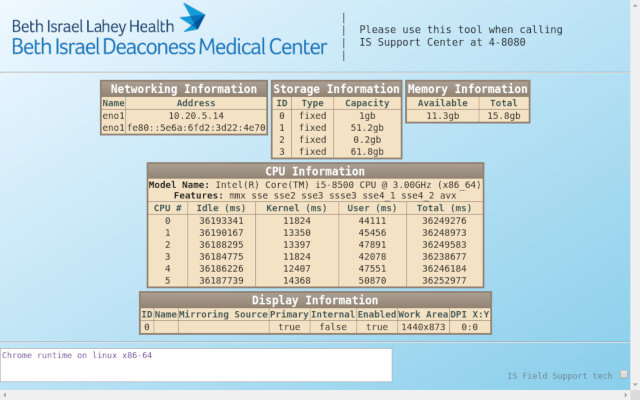

# 🏥 BIDMC ITS: Who Am I? ☁️
This [Chrome Extension](https://developer.chrome.com/extensions) is built for real-time querying the Chrome endpoint 💻 vital system information, such as CPU, memory and disk storage, etc.

It also provides a simplified [G Suite Admin](https://admin.google.com) (Google My Business) UI for our Information Services Inventory Control, Field and Help Desk support 👨‍💻 teams 👩‍💻 workflow: specifically, managing **Organization Unit** placement and the annotated field attributes: **asset id**, **location**, **user**, and **notes**.

There may be need / opportunity to expand this extension to include device registration with our standalone Electronic Health Record, [webOMR](https://apps.bidmc.org/webomr_training/), for printing and flag tasks (aka **ZO**).

See also: [BIDMC ITS: CrOSby](https://github.com/theflyingape/bidmc-its-crosby) APIs optionally used by this extension.

## Google Chrome APIs
* [Window](https://developer.chrome.com/apps/app.window.html)
* [Runtime](https://developer.chrome.com/apps/app.runtime.html)
* [CPU](https://developer.chrome.com/apps/system_cpu.html)
* [Display](https://developer.chrome.com/apps/system_display.html)
* [Memory](https://developer.chrome.com/apps/system_memory.html)
* [Network](https://developer.chrome.com/apps/system_network.html)
* [Storage](https://developer.chrome.com/apps/system_storage.html)

## Screenshot

